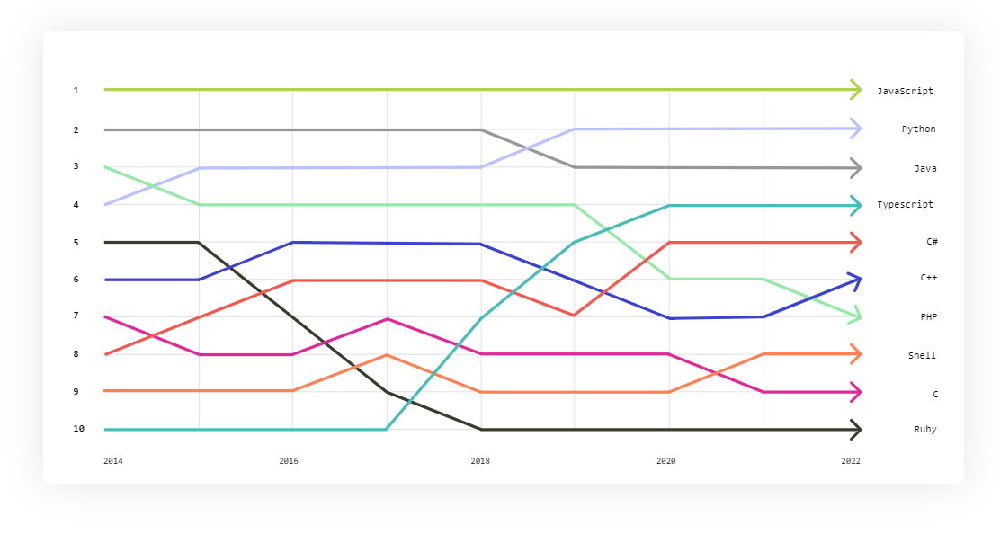

# Backend Java for Recruiters

> "Unlocking the path to exceptional candidates: A brief guide to enhance your talent search in Backend Java"

## Table of Contents

## Introduction

Java is the third most used language according to the [top programming languages](https://octoverse.github.com/2022/top-programming-languages) from [Github Octoverse 2022](https://octoverse.github.com/).

Here you can find some reasons why not only [Java is not dead](https://github.com/readme/featured/java-programming-language?utm_source=github&utm_medium=referral&utm_campaign=&scid=&utm_content=octoverse), but it is
actually ready for the future.

## Tech stack

### Core Java

* Widely-used, **object-oriented** programming language.
* Known for its simplicity, readability, and robustness.
* Platform-independent, compatible with different operating systems.
* Commonly used for server-side applications, web applications, and Android mobile apps.
* Strong focus on security.
* Vast ecosystem of tools and libraries.
* Benefits from a large and supportive community.
* Provides solid foundations for reliable and scalable software systems.

#### LTSs versions

**LTS**: Long-term support (LTS) is a product lifecycle management policy in which a stable release of computer software is maintained for a longer period of time than the standard edition.

##### Java 8

Brought significant language enhancements and introduced modern programming paradigms. It's crucial to assess candidates' familiarity with lambdas, streams, and functional programming concepts.

    * Lambdas and Functional Interfaces: Introduction of functional programming constructs, enabling more concise and expressive code.
    * Stream API: Stream-based processing for efficiently manipulating collections of data.
    * Default and Static Methods in Interfaces: Ability to add default implementations and static methods to interfaces, enhancing code reuse.

##### Java 11

JPMS

Introduced some language improvements and new features, such as local variable type inference. While not as revolutionary as Java 8, it's still beneficial for candidates to be aware of these changes.

    * Introduction of the Java Platform Module System (JPMS) for modularizing Java applications.
    * Local Variable Type Inference (var): Enhanced type inference for local variables, reducing verbosity in code.
    * HTTP Client API: A standardized HTTP client API, replacing the deprecated HttpURLConnection.
    * Flight Recorder: A low-overhead performance monitoring tool for profiling and analyzing Java applications.

##### Java 17

Brings important language enhancements, particularly sealed classes and pattern matching for switch. These additions improve code readability and maintainability. It's valuable for candidates to have familiarity with these modern features.

    * Sealed Classes: Enhanced class and interface modifiers to restrict subclasses and interfaces.
    * Pattern Matching for Switch: Simplifies code by allowing pattern matching directly in switch statements.
    * Foreign Function & Memory API: Enables interoperability with native code and direct memory access.

### Good practices

add be-general-guidelines here

### Dependency management / Build tools (Maven)

* Widely-used **build automation and dependency management** tool for Java projects.
* Provides a standardized way to manage project builds, dependencies, and documentation.
* Uses a declarative **XML-based configuration file called pom.xml (Project Object Model)** to define project settings and dependencies.
* With it, developers can easily compile, test, package, and deploy their Java applications.
* Simplifies dependency management by automatically resolving and downloading project dependencies from remote repositories.
* Supports the concept of repositories, where developers can publish and share their own libraries or access third-party libraries.
* Promotes best practices and conventions, making it easier for developers to follow standardized project structures and naming conventions.

### Spring framework

**Framework**: libraries or sets of pre-written code that provide reusable functionality to simplify the development process.

* One of the most popular and widely-used Java frameworks.
* Provides a comprehensive platform for building enterprise-level Java applications.
* Follows the principle of dependency injection and inversion of control, allowing for loose coupling and easier unit testing.
* Offers a modular approach, allowing developers to use specific components or features based on their project requirements.
* Key components of the Spring framework include:
    * Spring Boot: A framework for rapidly developing and deploying standalone Spring applications.
    * Spring MVC: A web framework for building robust and scalable web applications.
    * Spring Data: A module that simplifies database access and supports various data storage technologies.
    * Spring Security: A powerful security framework for securing applications and managing authentication and authorization.
    * Spring Integration: A module for building integration solutions and messaging-based applications.
    * Spring Cloud: A set of tools and libraries for building distributed systems and microservices architectures.

### Web Services

* Enable communication and data exchange between applications over the internet.
* Two main types of web services are **SOAP** (XML-based, RPC-oriented) and **REST** (lightweight, URL-based).
  * SOAP uses XML and a standardized protocol for communication.
  * **RESTful** web services use **JSON** or XML and follow REST principles using HTTP methods.
* Development involves implementing service **endpoints**, defining data models and contracts, implementing business logic, and ensuring security.
* Popular frameworks: SOAP (Apache CXF, Apache Axis, JAX-WS), REST (Spring Boot, JAX-RS, Express.js).
* Web services facilitate interoperability and integration between applications and systems.

### Databases and ORM

**Database**: Software system that store, manage and organize structured data.

* Common types of databases:
  * Relational
    * Store data in tables with predefined schemas and support SQL (Structured Query Language) for querying and manipulating data.
  * NoSQL
    * Offer flexible data models, such as key-value, document, columnar, and graph databases, and use different query languages or APIs.
  * In-memory
    * Store and manage data entirely in the main memory (RAM) of a computer, allowing for faster data access and retrieval compared to traditional disk-based databases.

**ORM(Object-Relational Mapping)**: Technique that allows developers to work with relational databases using object-oriented programming languages.

* Facilitates database management, simplifies database interactions, and improves productivity by reducing the amount of boilerplate code.
* Developers can focus more on the application's business logic rather than dealing with low-level database operations.

### Message Queue Systems

* Enable asynchronous communication between components or systems.
* Messages are stored in queues for reliable delivery and decoupling.
* They support various messaging patterns and ensure message ordering.
* Facilitate scalability, fault-tolerance, and high-throughput scenarios.
* They promote loose coupling and flexible system architectures.
* Features include message persistence, filtering, and prioritization.

### Testing

**Test coverage**: Measures the code tested by test cases.

* Ensures software quality and reliability. 
* Types of testing 
  * **Unit Testing**: Testing individual components or modules in isolation (commonly done by BE).
  * **Integration Testing**: Testing the interaction and communication between different components (commonly done by BE).
  * System Testing: Testing the entire system or application as a whole.
  * Acceptance Testing: Testing against business requirements to validate the software's functionality.
  * Performance Testing: Testing the system's performance under various load conditions.
  * Security Testing: Testing for vulnerabilities and ensuring the security of the software.

#### TDD

**TDD (Test-Driven Development):** TDD is a software development approach where developers write
automated tests before writing the actual code. The development cycle typically follows three steps:
write a failing test, write the minimal code to pass the test, and refactor the code for better design. 
TDD helps ensure that the code meets the specified requirements and improves code quality through
rigorous testing.

#### BDD

**BDD (Behavior-Driven Development):** BDD is a software development methodology that focuses on
defining and understanding the desired behavior of the software through collaboration between
developers, testers, and business stakeholders. BDD uses a specific syntax called Gherkin, which
allows the creation of human-readable specifications in the form of "Given-When-Then" scenarios.
These scenarios serve as acceptance criteria for both automated tests and documentation, promoting 
clear communication and alignment between technical and non-technical team members.

### Version control (Git)

* System that helps manage changes to files and code.
* Allows multiple developers to collaborate on the same project efficiently.
* Tracks changes, creates a history of modifications, and enables easy rollback.
* Developers use Git commands to create **repositories**, **commit** changes, and manage **branches**.
* Branching allows developers to work on different features or bug fixes simultaneously.
* **Pull requests** facilitate code review and collaboration before merging changes.
* Version control helps maintain code integrity, traceability, and collaboration.
* It enables teams to work concurrently without conflicts and provides a centralized repository.

### DevOps

#### Containerization

**Containerization:** Method of packaging and running applications with their dependencies in isolated environments called containers.

* Containers provide consistency and portability, enabling applications to run consistently across different environments.
* Docker is a popular containerization platform that simplifies the creation, distribution, and deployment of containers.
* Containers are lightweight, allowing for efficient resource utilization and scalability.
* Containerization facilitates application isolation, reducing conflicts between dependencies and ensuring consistent behavior.
* Containers can be easily deployed and managed using container orchestration platforms like Kubernetes.

#### Orchestration

**Orchestration:** Process of automating the management, deployment, and scaling of containers in a distributed system.

* Container orchestration platforms, like Kubernetes, provide tools for managing containerized applications at scale.
* Orchestration allows for automatic container deployment, scaling, and load balancing across multiple hosts.
* It simplifies the management of complex containerized systems, ensuring high availability and fault tolerance.
* Orchestration platforms handle tasks such as service discovery, health monitoring, and container scheduling.

#### CI/CD

**CI/CD (Continuous Integration and Continuous Delivery):** Practices that aim to automate software delivery processes.

* Continuous Integration (CI) involves regularly merging code changes into a shared repository, followed by automated build and testing.
* CI helps identify issues early, promotes collaboration, and ensures the stability of the codebase.
* Continuous Delivery (CD) extends CI by automating the deployment process to deliver software to production environments.
* CD pipelines include steps for building, testing, deploying, and releasing software in a streamlined and automated manner.

<!---

### Security

#### Authentication and Authorization

Understanding the concepts of authentication and authorization is crucial. This includes implementing
secure authentication mechanisms like **OAuth**, **JWT (JSON Web Tokens)**, or session-based authentication,
and implementing fine-grained access control to ensure that users have appropriate permissions to
access resources.

#### Secure Communication

Knowledge of securing communication channels is important. This involves implementing secure protocols
such as **HTTPS/TLS (Transport Layer Security)** to encrypt data transmitted over networks and prevent
eavesdropping and tampering.

#### Input validation and Sanitization

Ensuring the security of the application by **validating and sanitizing** user input is essential.
This helps prevent common security vulnerabilities like SQL injection, cross-site scripting (XSS),
and command injection.

#### Protection against Cross-Site Request Forgery (CSRF)

Understanding and implementing measures to prevent CSRF attacks is important. This involves using
techniques like CSRF tokens and validating requests to ensure they originate from trusted sources.

#### Secure session management

Implementing secure session management practices is crucial for maintaining the integrity and
confidentiality of user sessions. This includes handling session IDs securely, setting appropriate 
session timeout values, and protecting against session fixation attacks.

#### Secure password storage

Ensuring the proper storage of user passwords is critical. Using strong cryptographic hashing algorithms,
such as bcrypt or PBKDF2, to hash and salt passwords before storing them in the database helps
protect user credentials.

#### Handling sensitive data

Properly handling and securing sensitive data, such as personally identifiable information (PII)
or payment card information, is essential. Following industry best practices, such as encrypting data
at rest and in transit and applying access controls, helps mitigate the risk of data breaches.

#### Security Libraries and frameworks

Familiarity with security libraries and frameworks, such as OWASP Java Encoder, Apache Shiro,
or Spring Security, can assist in implementing common security features and best practices effectively.

#### Security standards and compliance

Awareness of industry security standards, such as OWASP Top Ten, PCI-DSS (Payment Card Industry Data
Security Standard), or GDPR (General Data Protection Regulation), can guide developers in adhering
to security best practices and legal requirements.

### Performance

--->

### Agile methodologies

### Troubleshooting and Debugging

### Software architecture

#### Hexagonal architecture

#### Clean architecture

#### Onion architecture

#### Microservices architecture

#### Event-Driven architecture (EDA)

#### Service-Oriented architecture

#### DDD

#### Event Sourcing and CQRS

## Cheat sheet

Here you will find a list of the different tools or equivalencies for each skill. 

### Java versions

### Skills

| Skills                        | Tools or Equivalencies                                                                           |
|-------------------------------|--------------------------------------------------------------------------------------------------|
| Java Frameworks               | Spring Boot                                                                                      |
| Web Development               | Servlets, JSP, JSF                                                                               |
| Web Services                  | RESTful APIs, SOAP                                                                               |
| Databases and ORM             | **Relational**: MySQL, PostgreSQL, Hibernate   **NoSQL**: MongoDB   **In-memory**: Redis |
| Message Queue Systems         | RabbitMQ, Apache Kafka                                                                           |
| Containerization              | Docker, Kubernetes, Podman                                                                       |
| Build Tool                    | Maven, Gradle, Ant                                                                               |
| Domain-Driven Design (DDD)    | -                                                                                                |
| Test-Driven Development (TDD) | JUnit, Mockito                                                                                   |
| Software Architecture         | Clean Architecture                                                                               |
| Version Control               | Git                                                                                              |
| Security                      | Spring Security, Java Security Frameworks                                                        |
| Performance Optimization      | -                                                                                                |
| Agile Methodologies           | Jira, Scrum, Kanban                                                                              |
| Troubleshooting and Debugging | Logs, Debuggers, Monitoring Systems                                                              |
| Continuous Learning           | -                                                                                                |

## Responsibilities

### Junior

* **Coding and implementation**: Writing clean and efficient code following coding standards and best practices.
* **Bug fixing and troubleshooting**: Identifying and resolving software defects and issues through debugging and problem-solving.
* **Testing**: Writing and executing unit tests to ensure the quality and reliability of the code.
* **Learning and skill development**: Actively learning new technologies, frameworks, and programming languages to enhance skills and contribute to the team's growth.
* **Collaboration**: Working closely with senior developers and team members to understand requirements, provide input, and contribute to discussions.
* **Documentation**: Documenting code changes, functionalities, and technical processes to facilitate maintenance and knowledge sharing.
* **Continuous improvement**: Identifying areas of improvement in existing code, processes, and practices, and suggesting solutions to enhance efficiency and performance.

### Mid(in addition to junior responsibilities)

* Architecture and Design: Participating in the design and architecture discussions to ensure scalable, maintainable, and efficient backend solutions.
* Module Development and Integration: Developing new modules and integrating them into existing systems.
* Performance Optimization: Analyzing and optimizing code and database queries to improve application performance.
* API Development: Designing and implementing RESTful APIs and integrating with external systems.
* Database Management: Managing database schema design, querying, and performance optimization.
* Mentoring Junior Developers: Assisting and mentoring junior team members by providing guidance, code reviews, and knowledge sharing.

### Senior(in addition to mid-level responsibilities) 

Completely independent

* Technical Leadership: Providing technical guidance, mentoring, and leadership to the development team.
* Architecture and System Design: Leading the design and architecture discussions, making decisions on technology stack, and ensuring adherence to best practices.
* Performance and Scalability: Identifying and resolving performance bottlenecks and designing scalable solutions.
* Security: Ensuring application security by implementing best practices, performing vulnerability assessments, and addressing security concerns.
* Code Review: Conducting thorough code reviews to ensure code quality, maintainability, and adherence to coding standards.
* Technical Strategy and Roadmap: Contributing to the technical strategy and roadmap of the project or organization, aligning it with business goals.
* Collaboration with Stakeholders: Collaborating with product managers, business analysts, and other stakeholders to understand requirements and provide technical insights.
* Troubleshooting and Production Support: Investigating and resolving complex technical issues in production environments and providing support as needed.

## Conclusion

Perfil tipo qiagen
Dejar guiar por sus preguntas, dejar espacio para questions